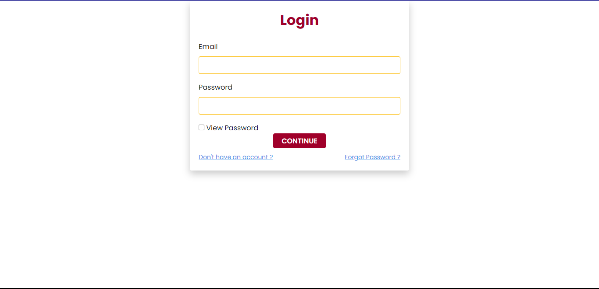
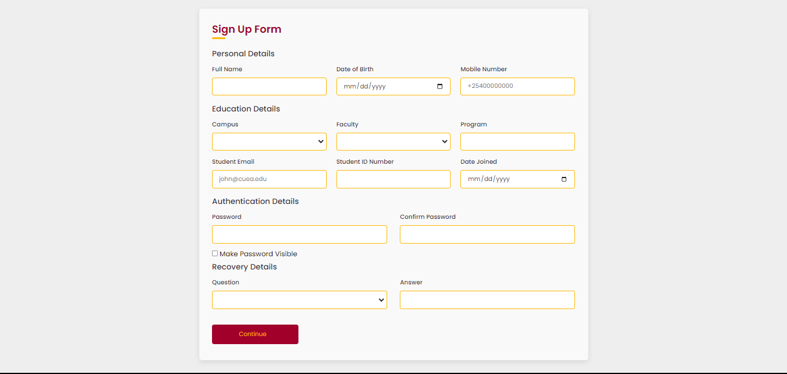
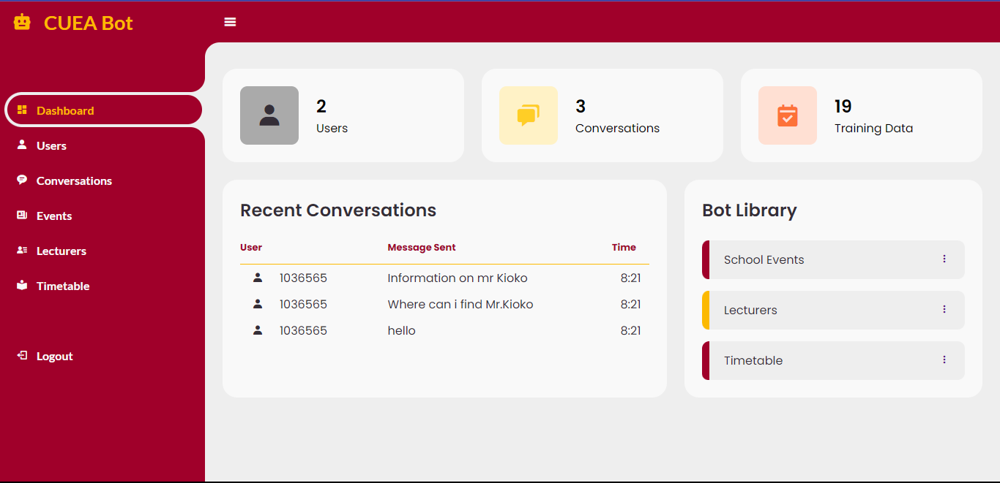
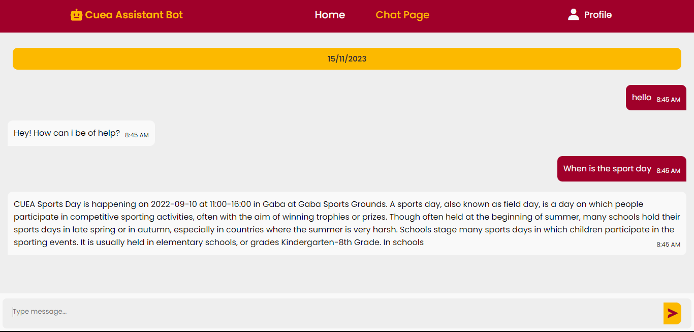

## CuBot

### Project Overview

Creating an ML/DL Chat bot using Vanilla Python as a backend and HTML, CSS, JS as a frontend

#### Main Objective

- To give students with immediate and convenient support by employing automated Chat bot technology.

#### Specific Objectives

- Improve Accessibility and Availability of Information
- Streamline Communication and Efficiency
- Enhance User Experience and Satisfaction

#### System Implementation

- The system is implemented using Vanilla Python as a backend and HTML, CSS, JS as a frontend.
- The database is implemented using MySQL.

#### System Features

- The system has a login and registration system.
- The system has a forget password system.
- The system has a Chat bot that can answer questions related to the timetable, lecturer information, and events
  calendar.
- The system has an administrative panel that can add, update, and delete information from the database.
- The Chat bot is trained from information in the database.
  i.e., The Chat bot is trained to answer questions related to
  the timetable, lecturers information, and events calendar.

#### System Limitations

- The system is not able to answer questions that are not related to the training data.
- The System works with python 3.8 to 3.11 as a result of the Tensorflow library.
- The chats cannot be reloaded after the page is refreshed.

#### How to set up the project locally

- Clone the project

  ```
  git clone
  ```

- Create a virtual environment
- Install the requirements

  ```
  pip install -r requirements.txt
  ```

- Connect to a MySQL database and create a database named 'cuebot'
- Run the project

  ```
  python server.py
  ```

##### Note

The first user created on registration is given admin privileges.
On the first signup, you are taken to the student page.
To access the admin page, logout then login with your credentials

#### Screenshots

- Login Page
  
- Registration Page
- 
- Admin Page
- 
- Chatbot Page
- 

